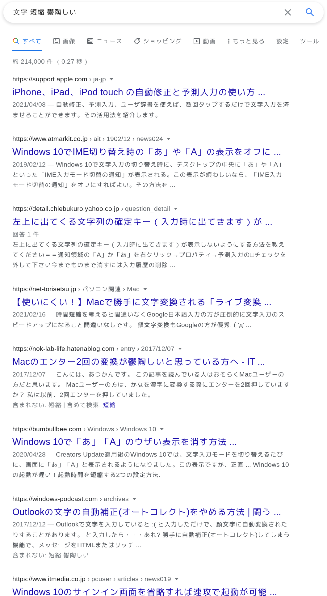
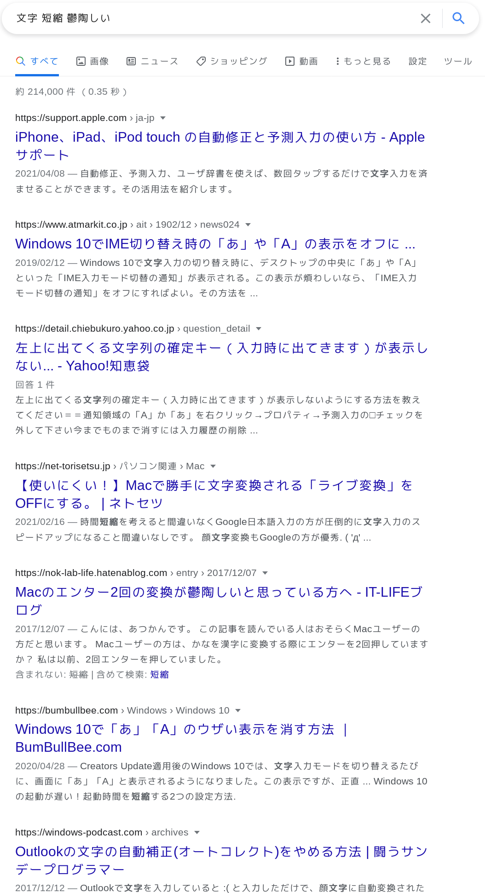

# google-search-title-qualified

Google will omit the title of the web page. With this add-on, the original title is used as much as possible.
And URL.

[Firefox Add-ons](https://addons.mozilla.org/firefox/addon/google-search-title-qualified/)

[Chrome Web Store](https://chrome.google.com/webstore/detail/google-search-title-quali/bjcnnhojddnonjmhlpdjcdcfmofliagb)

# English

This rewrites Google's search results page to show Use the original title of your site as much as possible, instead of the Google-generated title.
It is an extension that rewrites the Google search results page to display the original title of the site as much as possible.

URLs are also not shortened as much as possible.

Firefox and Chrome are supported.

## Reason for development.

## I don't want to shorten it.

The web page titles in Google's search results are shortened to The web page title in Google search results is shortened to a fairly short standard.

I don't care if it's a new line.
I want to see the full title.
I don't want to have to open each search result.

### Google's Title Interpretation Measures

Also, in recent years In addition, in recent years, there have been a number of cases where the title of Wikipedia or ArchWiki is converted into something unintelligible.

Reference: [Wikipediaページ、「Emacs」が「Emacs小指」と表示される - Google 検索セントラル コミュニティ](https://support.google.com/webmasters/thread/68265671/wikipedia%E3%83%9A%E3%83%BC%E3%82%B8%E3%80%81%E3%80%8Cemacs%E3%80%8D%E3%81%8C%E3%80%8Cemacs%E5%B0%8F%E6%8C%87%E3%80%8D%E3%81%A8%E8%A1%A8%E7%A4%BA%E3%81%95%E3%82%8C%E3%82%8B?hl=ja)

If you're smart, this won't be a problem.
But if it's smart, it's not a problem.
I want original search results.

### Anti-spam site

[iorate/uBlacklist: Blocks specific sites from appearing in Google search results](https://github.com/iorate/uBlacklist)
In
[ncaq/uBlacklistRule: uBlacklist向けのルールです。](https://github.com/ncaq/uBlacklistRule/)
to block spam sites as much as possible,
However, it is difficult to block all spam sites because they increase like bamboo shoots.
It is difficult to block them all.

By looking at the full title. By looking at the full title, you will have a better chance of recognizing a spam site before you even open it.

## Notes

This add-on accesses almost all of the result pages when you search and fetches the title element.
This will increase the amount of data traffic.

It only fetches the top-level HTML.
This add-on does not increase the data traffic as much as you might think.
However, if you are using a mobile connection, you should be careful.

# Japanese

これはGoogleの検索結果ページを書き換えて、
Googleが生成したタイトルではなく、
なるべくサイトオリジナルのタイトルを検索結果ページに表示する拡張機能です。

URLも極力短縮させません。

FirefoxとChromeに対応しています。

## 開発理由

### 短縮させたくない

Googleの検索結果のwebページタイトルは、
かなり短い基準で短縮されてしまいます。

別に改行されても良いので、
タイトルはフルで見たいです。
検索結果を一々開くのが面倒なのです。

### Googleのタイトル謎解釈対策

また近年、
WikipediaやArchWikiのタイトルを意味不明に変換する事案がよく見られます。

参考: [Wikipediaページ、「Emacs」が「Emacs小指」と表示される - Google 検索セントラル コミュニティ](https://support.google.com/webmasters/thread/68265671/wikipedia%E3%83%9A%E3%83%BC%E3%82%B8%E3%80%81%E3%80%8Cemacs%E3%80%8D%E3%81%8C%E3%80%8Cemacs%E5%B0%8F%E6%8C%87%E3%80%8D%E3%81%A8%E8%A1%A8%E7%A4%BA%E3%81%95%E3%82%8C%E3%82%8B?hl=ja)

賢いなら問題ないのですが、
おおよそバカな変換をしてくるため、
サイトオリジナルの検索結果が欲しいです。

### スパムサイト対策

[iorate/uBlacklist: Blocks specific sites from appearing in Google search results](https://github.com/iorate/uBlacklist)
に、
[ncaq/uBlacklistRule: uBlacklist向けのルールです。](https://github.com/ncaq/uBlacklistRule/)
を適用してスパムサイトをなるべくブロックしていますが、
スパムサイトは筍のように増えるので、
全てブロックするのは困難です。

フルのタイトルを見ることで、
開く前からスパムサイトだと気が付ける可能性が増えます。

## 注意事項

このアドオンは検索すると結果ページほぼ全てにアクセスしてtitle要素を取ってくるため、
データ通信量が増えます。

トップレベルのHTMLしか取得しないので、
意外とそこまで通信量は増えませんが、
モバイル回線を使っている場合には注意が必要です。

# screenshot

## before

## after

# How to build

~~~console
yarn
yarn package
~~~
